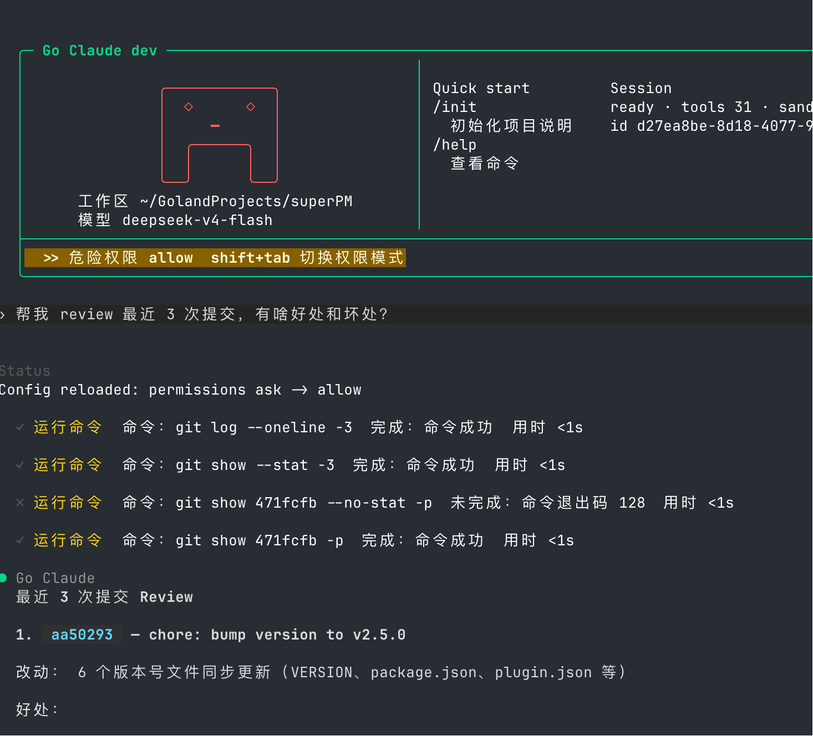
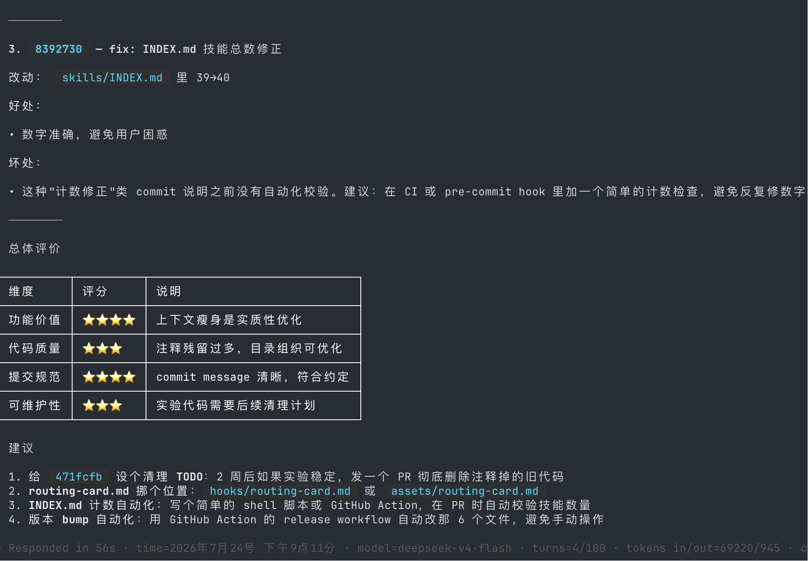
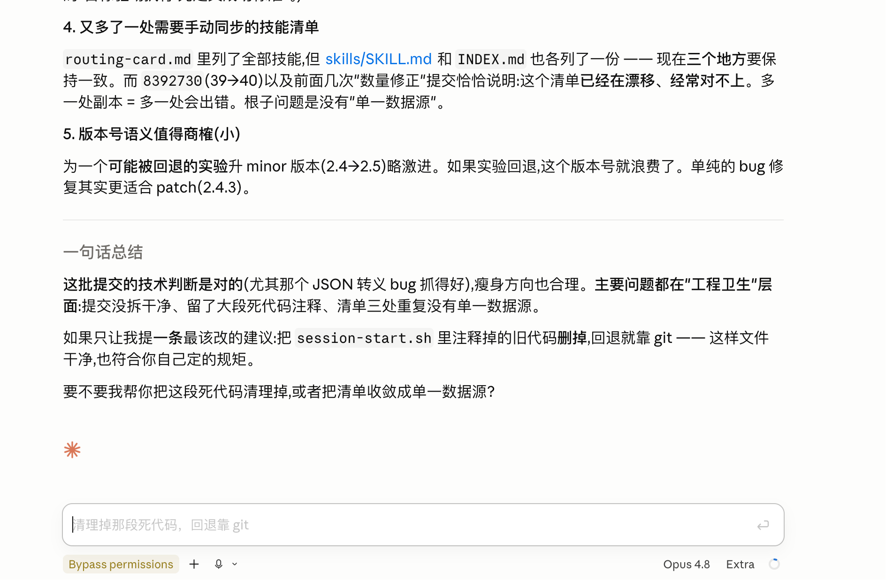

# TUI 模式使用说明

TUI 是本地交互式终端模式，适合边写代码边对话、读文件、跑工具、审批权限。启动即进入，无需任何参数：

```bash
go run ./cmd/golang-cc
# 指定另一个项目作为上下文
go run ./cmd/golang-cc --cwd /path/to/project
```

每个场景统一结构：**一句话定位 → 命令 → 界面说明 → 要点**。除「代码审查」一节，本页不放截图，理由见 [使用说明总入口](README.md#为什么这里几乎没有截图)。

常用快捷键速查（完整清单在根 [README](../../README.md) 的「常用 TUI 操作」表）：

| 操作 | 快捷键 / 命令 |
| --- | --- |
| 停止响应 / 退出 | 第一次 `Ctrl+C` 停止，第二次 `Ctrl+C` 退出 |
| 清空输入 | `Ctrl+U` |
| 切换权限模式 | `Shift+Tab` |
| 切换鼠标模式 | `Ctrl+O`（copy / scroll） |
| 粘贴剪贴板图片 | `Ctrl+V` |
| 查看 slash 命令 | 输入 `/` |

输入等待队列：任务运行中按 Enter 会确认加入队列，任务空闲后按当前顺序逐条执行；
候选面板中使用 `Ctrl+Up` 上移，`/queue direction <id> <text>` 调整方向，
`/queue retry <id>` 重试失败候选，`/queue off`/`/queue on` 关闭或开启排队，
`/queue delete <id>` 删除候选。普通 textarea 的上、下箭头仍保持光标和滚动行为。

---

## 1. 简单对话

最轻量的用法：直接聊天、问身份、追问"你怎么知道的"。启动后即可输入。

```bash
go run ./cmd/golang-cc
```

打招呼、问"你什么模型"——模型信息来自会话初始化时注入的 `Environment` 元数据，不是从项目文件读取，所以它能直接回答。追问"你怎么知道的"，它会说明这段信息是运行环境写入系统提示的，无需 Read/Grep 工具。

**要点**

- 顶部欢迎框显示工作区、模型、`sessionId`、tools 数量、sandbox 状态。
- 每条回复底部是 usage 面板：`turns=2/100`（对话轮次）、`tokens in/out`、`cache read/write`、`turn_hit%`（prompt cache 命中率）。
- 未使用 `--model` 时支持 per-turn 配置刷新：改了配置，下一条消息会重新读取模型。

---

## 2. 单个简单任务

给一个一步就能完成的任务（读文件、总结、列目录），通常只触发一次工具调用。

```bash
go run ./cmd/golang-cc
# 输入：查看当前目录有哪些文件
# 输入：帮我总结 README.md
```

工具活动面板会实时显示一行，形如 `✓ 查看文件  文件：README.md  完成：读取 250 行  用时 <1s`。

**要点**

- 工具活动面板逐条展示工具名、参数、完成状态和耗时。
- 文件读写、搜索、列目录都走统一的工具接口（`Read`/`Edit`/`Grep`/`LS` 等）。
- 简单任务通常不需要审批；只有触碰 `permissions` 里 `ask` 的动作才会弹审批。

---

## 3. 代码修改（含权限审批）

真正的 coding 场景：让它改代码、跑测试。写文件和执行命令会受权限策略约束。

```bash
go run ./cmd/golang-cc --cwd /path/to/your-project
# 输入：给 xxx 函数加一个边界条件测试，然后让测试通过
```

`Edit`/`Write`/`Bash` 命中 `ask` 规则时弹出审批弹窗，可选择允许一次 / 始终允许 / 拒绝；审批卡片只占屏幕底部若干行，本轮已产生的输出仍留在屏幕上和终端滚动区。改完后执行 `go test` 等命令验证，结果直接回显在工具活动面板。

**要点**

- `Shift+Tab` 切换权限模式；顶部黄条会显示当前模式（如 `危险权限 allow`）。
- 权限遵循 Claude Code 兼容的 `permissions.allow` / `deny` / `ask` / `defaultMode` / `additionalDirectories`。
- macOS Seatbelt、Linux bubblewrap/seccomp 沙箱为命令执行提供 OS 级隔离。
- 详见根 [README 权限说明](../../README.md) 与 [兼容性矩阵](../compatibility_matrix.md)。

---

## 4. Skills 使用与创建

Skills 是可复用的任务指令包。命中相关请求时按需渐进式加载，无需手动开关。

```bash
go run ./cmd/golang-cc
# 输入 / 查看可用 slash 命令与已注册 skills
```

触发某个 skill 时，先读 metadata catalog，再 lazy 加载对应 `SKILL.md`。

**使用要点**

- 渐进式加载：先加载轻量 metadata，真正用到时才读完整 `SKILL.md`，节省上下文。
- 支持 paths 过滤、runtime frontmatter、forked skill、marketplace、bundled/MCP/plugin 多来源。
- 加载链路与目录约定见 [docs/skills/skills_progressive_loading.md](../skills/skills_progressive_loading.md)。

### 创建一个新 skill

不只是用 skill——可以直接让 golang-cc 帮你**创建**一个新 skill 并落盘：编写带 frontmatter 的 `SKILL.md`、更新项目的路由/清单文件，一步到位。

```bash
go run ./cmd/golang-cc --cwd /path/to/your-skill-project
# 输入：帮我新增一位「梁文锋」AI 技术理想主义视角的专家 skill
```

一次真实运行：在一个专家路由项目里让 golang-cc 新建一位专家 skill——它生成了完整的 `experts/liang-wenfeng-perspective/SKILL.md`（含决策启发式、表达 DNA、Agentic Protocol、诚实边界），新增 `router_keywords.json` 的 `ai_technology` 路由规则，并在主 `SKILL.md` 专家清单补一行，最后自动提交推送（同下方「Git 提交与推送」场景）。

**创建要点**

- 一个 skill 至少要有 `name` / `description` 的 frontmatter，放到 skills 根目录即可被发现并触发。
- golang-cc 会按目标项目的既有结构落盘（示例里是 `experts/` + `router_keywords.json` + 主 `SKILL.md`，这是该项目自己的约定，不是 golang-cc 强制格式）。
- 创建后可直接接一句「提交并推送」，让它跑 git 收尾——见 [10. Git 提交与推送](#10-git-提交与推送)。

---

## 5. 网络搜索

需要实时信息时调用 WebSearch / WebFetch / WebBrowser 工具。

```bash
go run ./cmd/golang-cc
# 输入：搜索一下 xxx 的最新进展
```

搜索结果作为工具输出回传，模型基于结果作答。

**要点**

- 默认搜索端点可通过配置 `webSearch.endpoint` 覆盖（支持国内端点）。
- `WebFetch` 抓取指定 URL 正文，`WebBrowser` 走真实浏览器（依赖 Node/Chromium 环境）。
- 端点、配置覆盖与网络边界见 [docs/web_search.md](../web_search.md)。

---

## 6. 多 subagent 并行

复杂任务可拆给多个子代理并行处理，主会话负责分发与汇总。

```bash
go run ./cmd/golang-cc
# 输入：分别从性能、安全、可读性三个角度审查这次改动
```

`Task` 会派发子代理，每个子代理有独立 transcript / tool loop / model，TUI 展示 nested progress。

**要点**

- 子代理运行时支持 batch、priority、timeout、retry、cancel。
- 每个子代理独立上下文，互不干扰，结果回传主会话再综合。
- 是把主 agent 当"分发器"、子 agent 当"工人"的多智能体底座。
- 编写子代理见 [docs/subagent_multiagent/agent_authoring_guide.md](../subagent_multiagent/agent_authoring_guide.md)。

---

## 7. 会话管理（恢复 / 回退 / 分支）

长会话可以恢复、生成 recap、非破坏性回退到某条消息、查看和切换分支。

```bash
# 继续最近一次会话
go run ./cmd/golang-cc --continue
# 恢复指定 session
go run ./cmd/golang-cc --resume <session-id>
```

TUI 内 slash 命令：

| 命令 | 作用 |
| --- | --- |
| `/resume` | 打开会话恢复选择器 |
| `/recap`、`/recap show` | 生成 / 查看会话 recap |
| `/rewind <message-id>` | 非破坏回退代码和/或对话（`--conversation-only` / `--files-only`） |
| `/branches` | 查看分支，`--compare <叶A> <叶B>` 对比 |
| `/redo <叶id>` | 切回被搁置的分支（默认还原文件+对话） |

回退是非破坏的：产生新分支而非丢弃历史，随时可 `/redo` 切回。

**要点**

- transcript 默认 v2 消息图（append-only 树 + `parent_id` / `branch_head`）。
- resume 会继续把完整 transcript 注入下一轮上下文，并默认回显最近 6 条历史（`tui.resumeHistoryLimit` 可调）。
- Thinking 支持 `full / summary / hidden`：`/thinking full` 展示完整思考轨道，`/thinking summary` 折叠为摘要，`/thinking hide` 隐藏主 UI 正文；`/thinking show <turn>` 展开指定回合，`/thinking summary <turn>` 或 `Esc` 收起详情。
- 可在 `tui.thinkingMode` 持久配置模式。未配置时继续兼容 `tui.showThinking`：`true/false` 映射为 `full/hidden`。这些设置只影响 TUI 展示，模型推理、`thinking_delta`、session、Trace 和 token 统计不受影响。
- 已经打印到 terminal scrollback 的内容不会被撤回；summary 模式只为尚未打印和后续 phase 固化摘要，展开使用独立可滚动详情。
- 图解与命令速查见 [docs/session_quickstart.md](../session_quickstart.md)，设计见 [docs/transcript/README.md](../transcript/README.md)。

---

## 8. Goal 模式与 /loop 定时任务

把长期目标交给状态机自动推进，或让某个 prompt 定时循环执行。

```bash
go run ./cmd/golang-cc
# Goal：先查看帮助，再创建并启动后台执行
/goal help
/goal start Implement TUI app-level selection
# 复制 start 返回的 goal id
/goal run <goal-id> --background
/goal status <goal-id>
/goal inspect <goal-id> # status 的别名
/goal logs <goal-id>
/ps
/logs <background-id>
/goal stop <goal-id>
/goal resume <goal-id>
/goal run <goal-id> --background
# Loop：定时执行并立即跑一次
/loop 5m check the deploy
/loop check the deploy every 20m
```

Goal 每个 turn 前自动创建 checkpoint，记录事件、usage、状态和 blocker；`/loop` 底层用本地 cron scheduler。

**要点**

- 输入 `/goal` 时，候选菜单会显示中文用途；全局 `/help` 显示中文短说明，`/goal help` 显示完整中文生命周期说明。命令名和参数仍保持英文。
- `/goal start` 只创建目标，`active` 只表示可运行，不表示 worker 已启动；长期任务推荐 `/goal run <goal-id> --background`。
- `/goal resume` 只恢复状态，恢复后需要再次 `/goal run`。
- `/goal logs <goal-id>` 是 Goal 状态机事件；`/logs <background-id>` 是后台进程输出，两种 ID 不通用。
- 没有活动目标时，裸 `/goal` 显示新手帮助；普通问题不要写成 `/goal 这个命令是做什么的`，应直接作为聊天消息发送。
- Goal 只有显式 `/goal stop` 才进入 `stopped`；`Ctrl+C` 仍只停止当前响应 / 退出 TUI。
- Loop 任务用 `ps` 查看、`logs <id>` 看输出、`kill <id>` 停止。
- 设计见 [docs/goal_mode/goal_mode_design.md](../goal_mode/goal_mode_design.md) 与 [docs/architecture/loop_scheduler_design.md](../architecture/loop_scheduler_design.md)。

---

## 9. 自动压缩与 usage 面板

上下文接近上限时自动压缩较早的对话为结构化摘要，保留最近轮次；usage 面板实时展示消耗。

```yaml
# ~/.golang-cc/settings.json 或 config/config.yaml
autoCompact:
  enabled: true
  defaultThresholdRatio: 0.75
  preserveRecentRounds: 6
  modelContext:
    gpt-5.5: 200000
  modelThresholdRatio:
    gpt-5.5: 0.5
```

触发压缩时会把较早的完整对话轮次替换为摘要，保留最近 rounds、当前输入和成对的 tool_use/tool_result。

**要点**

- 自动压缩默认关闭；开启后按模型 context 大小 × 阈值比例判断是否触发。
- 摘要叠加运行时提取的硬事实（文件路径、命令、URL、工具调用、错误、用户约束）。
- 连续失败达到 `maxFailures` 会暂停本会话自动压缩，避免反复失败。
- usage 面板字段：`tokens in/out`、`cache create/read`、`turn_hit%`。

---

## 10. Git 提交与推送

改完代码或创建完文件后，直接在对话里让 golang-cc 跑 git 收尾——`git status` / `commit` / `push` 都走「运行命令」（Bash）工具，和其他命令一样受权限约束。

```bash
go run ./cmd/golang-cc --cwd /path/to/your-project
# 输入：把这次改动提交并 push 到远程
```

接着上面「创建 skill」的那次运行：生成/更新文件后，golang-cc 依次跑 `git status`、`git commit`（`a278ea7 添加梁文锋专家Skill：AI技术理想主义视角`）、`git push`，终端回显「已成功推送到远程仓库 `ec60813..a278ea7 main -> main`」。

**要点**

- git 操作通过「运行命令」工具执行：权限为 `allow` 时直接跑，`ask` 时会先弹审批。
- 提交信息、要不要新建分支、推到哪个 remote，都由你在对话里指定。
- golang-cc 会遵循目标项目的提交规范（如 `golang-cc.md` / legacy `CLAUDE.md` 里约定的 commit message 规则、身份要求等）。
- 和「代码修改」（[3](#3-代码修改含权限审批)）、「创建 skill」（[4](#4-skills-使用与创建)）天然衔接：改完/建完直接提交推送，形成闭环。

---

## 11. 代码审查（Review 提交）

让 golang-cc 审查最近几次提交并给出结构化评价：它会自己编排多条只读 git 命令读取历史和 diff，再输出好处/坏处、评分表和可执行建议。

```bash
go run ./cmd/golang-cc --cwd /path/to/your-project
# 输入：帮我 review 最近 3 次提交，有啥好处和坏处？
```



*它自动跑 `git log --oneline -3`、`git show --stat -3` 读历史；其中 `git show 471fcfb --no-stat -p` 退出码 128 失败后，改用 `git show 471fcfb -p` 重试成功——一次真实的错误恢复。*



*逐条给出每次提交的改动/好处/坏处，最后汇总成「总体评价」评分表（功能价值、代码质量、提交规范、可维护性）和一组可执行「建议」。*

**要点**

- 多步工具编排：一次 review 自动串起多条只读 git 命令（`log` / `show` / diff）。
- 错误恢复：某条命令失败（如 exit 128）会调整参数重试，而不是直接放弃。
- 结构化产出：好处/坏处 + 评分表 + 建议，便于直接落地（如「给实验代码设清理 TODO」「计数 / 版本 bump 自动化」）。
- 全程只读，不改动仓库；要落地某条建议，再另起一轮让它执行、再走 [10. Git 提交与推送](#10-git-提交与推送)。

### 💡 效果取决于模型：同一任务的深度对比

同一 prompt、同一项目（superPM），只换模型和 agent 平台——上面是 golang-cc 跑 `deepseek-v4-flash`，下面是 Claude Code 跑 `Opus 4.8`（扩展思考）对同一批提交的 review。



*Opus 4.8 把 `8392730`(39→40) 这类"数量修正"提交上升为根因诊断——"三处清单副本、缺单一数据源"，并质疑 semver 语义（把可能回退的实验升 minor 偏激进），最后给出单条最高优先级建议并主动提出代为清理。*

| | golang-cc · deepseek-v4-flash | Claude Code · Opus 4.8 |
| --- | --- | --- |
| 分析深度 | 逐条好处/坏处 + 评分表，清单式 | 追根因（缺单一数据源）、质疑版本语义 |
| 建议 | 4 条并列 | 一条最高优先级 + 主动代办 |
| 成本 / 速度 | 便宜快（56s） | 慢且贵，深度更高 |

**用法提示**：审查、分析这类"要深度推理"的任务，模型强弱直接决定产出质量。golang-cc 是 provider / model 中立的 runtime——同一套流程（多步工具编排、错误恢复、结构化产出）在弱模型上已经跑通，换上更强的模型即可逼近上面的深度。

---

← 返回 [使用说明总入口](README.md) · 其他模式：[CLI](cli.md) · [agent-webui](webui.md)
