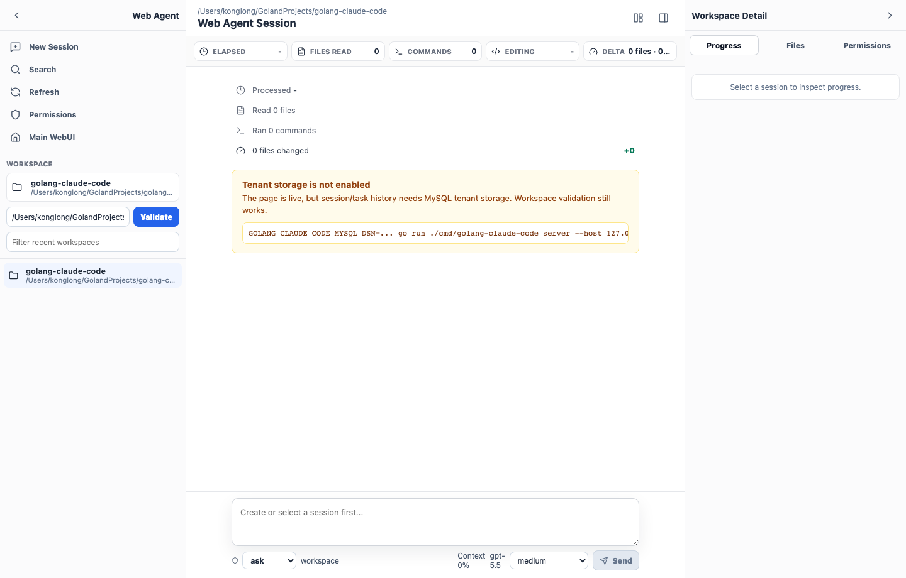
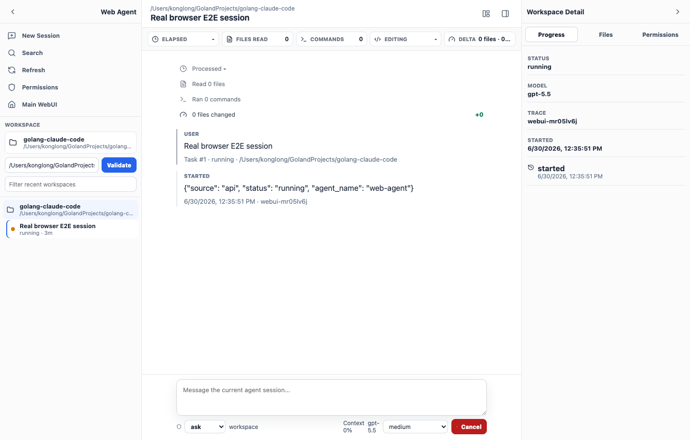
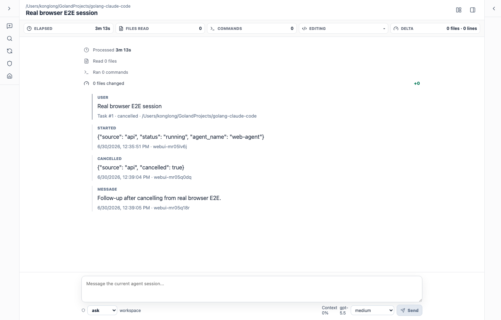
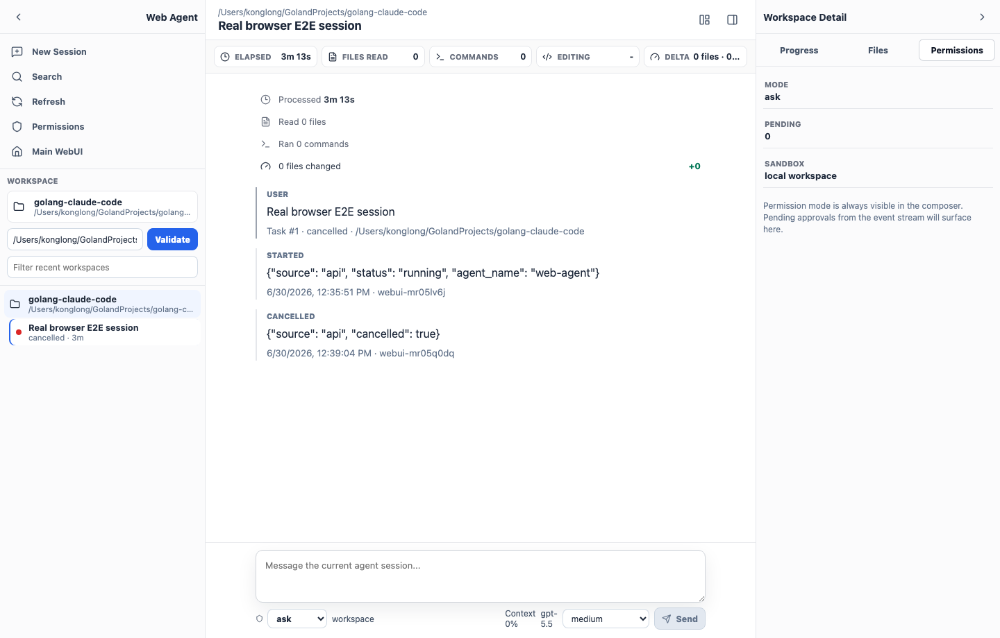
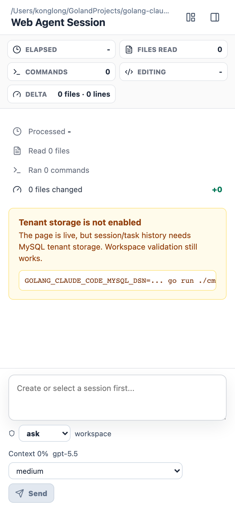
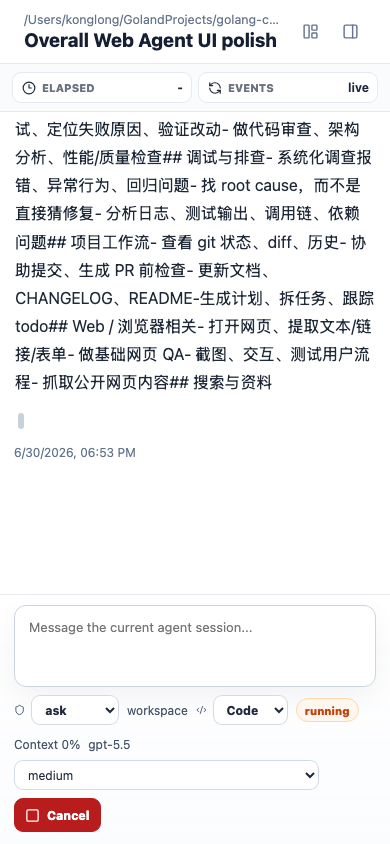

# agent-webui 模式使用说明

agent-webui 模式把 golang-cc 跑成一个带浏览器界面的 Web Agent：API Server 提供 SSE / WebSocket 后端，`web/`（Vite + React + TypeScript）提供前端，支持任务创建、运行、取消、多轮会话和全链路观测。

启动（手工验收 profile，复用历史 WebUI 会话）：

```bash
scripts/web-agent-start.sh manual
```

隔离真实 E2E：

```bash
scripts/web-agent-start.sh e2e
```

手动分步启动：

```bash
# 终端 1：API Server
export GOLANG_CC_MOBILE_DEV_AUTH=true
go run ./cmd/golang-cc server --host 127.0.0.1 --port 8080 --auth-token test-token

# 终端 2：前端开发服务器
npm --prefix web install --legacy-peer-deps
npm --prefix web run dev
```

> 本页的截图全部来自已有的 Web Agent 真机 E2E 证据（`../web_agent/images/`）——那批图是当时验收留下的产物，有对应的验证脚本兜底。没有对应证据图的场景改用文字说明，理由见 [使用说明总入口](README.md#为什么这里几乎没有截图)。

---

## 1. 启动与首屏

启动后打开浏览器进入 WebUI，左侧会话列表、中间对话区、右侧任务/详情面板。

```bash
scripts/web-agent-start.sh manual
# 或构建后由 API Server 托管：
#   npm --prefix web run build
#   export GOLANG_CC_WEBUI_DIR=web/dist
#   go run ./cmd/golang-cc server --host 127.0.0.1 --port 8080 --auth-token test-token
# 访问 http://127.0.0.1:8080/webui/?token=test-token
```



*桌面三栏布局：会话列表 / 对话区 / 任务详情。*

**要点**

- `scripts/web-agent-start.sh manual` 拉起真实 provider + MySQL + WebUI，复用 `golang_cc_webui_local` 的 `yutang / feishu-e2e-user` 历史会话。
- `scripts/web-agent-start.sh e2e` 使用隔离的 `golang_cc_web_agent_real_e2e` 和 `webui-local / webui-local-user`，供真实 E2E 使用。
- `scripts/web-agent-restart.sh manual` 是手工验收的默认重启方式；启动日志会打印 profile、数据库、租户和用户。
- 也可 `npm --prefix web run build` 后由 API Server 直接托管静态资源。前端还没 build 时 `/webui` 不会给 404，而是返回 503 加一页构建说明。
- 前端维护说明见 [docs/webui/webui_frontend.md](../webui/webui_frontend.md)。

### 图片生成与编辑

从主界面左侧一级导航进入“图片生成”，打开独立图片工作台；它不再占用 Web Agent 的“工作区详情”区域。Web Agent 也可输入 `/image`，或输入 `/image <提示词>` 直接带着当前会话跳转到图片工作台。

工作台绑定当前租户并提供会话选择，支持两种操作：

- **生成**：输入提示词并提交，工作台会从 `GET /tenant/images/capabilities` 加载可用 provider、图片模型、分辨率和宽高比；默认仍兼容全局 `imageGeneration.provider/model`。
- **编辑/重绘**：上传图片，或从当前会话历史选择已有图片作为来源；第一阶段支持单图编辑，Agnes 使用 `/images/generations` + `extra_body.image`，不上传 mask。

生成结果会出现在工作台历史和 Agent 消息流中。结果以租户、用户和会话三重作用域持久化，刷新页面或重启服务后可从历史恢复；下载按钮读取受控 asset URL，不暴露本地文件路径或图片 base64。未配置图片服务时，工作台会显示配置错误而不会影响普通对话。

启用示例（全局 settings JSON）：

```json
{
  "imageGeneration": {
    "enabled": true,
    "provider": "jiuan",
    "model": "gpt-image-2",
    "catalog": [
      {"provider":"sensenova","model":"sensenova-u1.5-lite","resolutions":["1K","2K","4K"],"aspectRatios":["1:1","4:3","16:9"]},
      {"provider":"agnes","model":"agnes-image-2.5-flash","resolutions":["1K","2K","3K","4K"],"aspectRatios":["1:1","3:4","4:3","16:9","9:16","2:3","3:2","21:9"]}
    ]
  }
}
```

`provider` 必须引用已有 provider 配置，因此图片服务复用其 `baseURL` 和认证信息；项目配置无需保存图片密钥。Agnes 默认要求 Base64，URL 结果会由服务端下载并保存后再返回受控 asset URL。Agent 也可通过 `GenerateImage` / `EditImage` 工具执行相同能力。

WebUI 的图片工作台和 tenant image HTTP API 在本阶段仍是同步路径，返回既有 Artifact JSON；`asyncChannelEnabled` 只影响 Feishu channel account。channel 任务受理后由独立 image worker 生成，图片会在受理卡片之后延迟出现在会话中。可在 Feishu 中使用 `/image status|cancel|retry <generation_id>` 查看、取消或人工重试；人工重试会建立新的 generation 并保留原任务关联。

---

## 2. 简单对话（SSE 流式）

在对话框直接发消息，回复以 SSE 流式打字机效果逐字返回。

消息通过 `/mobile/chat/*` 走 SSE 流式返回，前端逐字渲染。

**要点**

- 后端支持 JWT、session CRUD、SSE、WebSocket 同步、cancel、regenerate、branch。
- 长回复流式可靠性方案见 [docs/web_agent/web_agent_streaming_reliability_plan.md](../web_agent/web_agent_streaming_reliability_plan.md)。

---

## 3. 单任务创建与运行

发起一个需要工具执行的任务，Web Agent 创建任务并驱动 runner 执行，界面实时反映状态。



*任务创建后加载到界面，进入运行状态。*



*真实模型任务在中间对话区运行，事件流实时刷新。*

**要点**

- 任务生命周期、runner 接入见 [docs/web_agent/web_agent_lifecycle_runner_fix_plan.md](../web_agent/web_agent_lifecycle_runner_fix_plan.md)。
- 全链路真机 E2E 验证脚本：`scripts/web-agent-real-e2e.sh`。

---

## 4. 任务取消 / 重试

运行中的任务可以中途取消；界面回到可继续操作的状态。



*取消后任务停止，界面恢复到可再次发起的状态。*

**要点**

- 后端提供 cancel 与 regenerate 能力。
- 取消是干净停止，不破坏已有会话历史。

## 5. 用户输入等待队列

当前任务运行时仍可继续输入并按 Enter 确认，输入会显示在 composer 上方的编号队列中；
当前任务空闲后，候选按当前顺序逐条执行。候选行的上箭头只把该条向前移动，不会立即
启动任务。

每条候选支持编辑消息、调整方向、删除和失败重试。溢出菜单中的“在侧边聊天中打开”
会创建独立分支，不会改变主队列；“关闭排队”只停止新增候选，已有候选不会被删除。
方向文本会和原消息一起写入实际用户输入，便于回看和审计。

---

## 6. 多轮会话（session / conversation 分层）

一个 session 下可以有多轮 conversation，Web Agent 用分层模型管理它们的关系。

session 与 conversation 是两层：session 是持久容器，conversation 是其中的一次次交互。

**要点**

- 分层模型见 [docs/web_agent/web_agent_session_conversation_model.md](../web_agent/web_agent_session_conversation_model.md)。
- 支持 branch：从某轮分叉出新对话线。

---

## 7. Trace 全链路观测

用 Trace Viewer 查看一次会话的完整 timeline：工具/模型耗时、tokens、权限、skill、sub-agent 和错误事件。

```text
http://127.0.0.1:8080/trace?token=test-token
```

Trace Viewer 同时覆盖本地 TUI/CLI transcript 会话与 API/Mobile/OpenAI-compatible tenant session。

**要点**

- 展示每次请求的模型、最终 provider、attempt、fallback、耗时和 token 消耗。
- 页面结构与数据来源见 [docs/observability/trace_viewer.md](../observability/trace_viewer.md)。

---

## 8. 桌面 / 移动响应式布局

同一套 WebUI 适配桌面宽屏与移动窄屏，面板可折叠。



*移动端窄屏下三栏折叠为单列，聚焦当前对话。*



*移动端 UI 审计截图，验证窄屏下的排版与交互。*

**要点**

- 桌面/移动响应式，右侧面板可折叠（见 `../web_agent/images/` 下 desktop / narrow / collapsed 系列）。
- 与 TUI 的显示效果差距分析见 [docs/web_agent/tui_display_parity_gap_analysis.md](../web_agent/tui_display_parity_gap_analysis.md)。

---

← 返回 [使用说明总入口](README.md) · 其他模式：[TUI](tui.md) · [CLI](cli.md) · Web Agent 真机 E2E 使用说明：[中文](../web_agent/web_agent_real_e2e_usage_zh.md)
