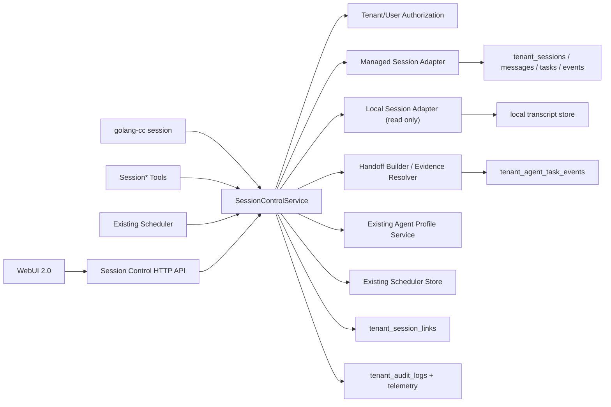
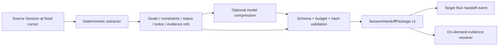

# go-cc WebUI 2.0 产品与技术架构

## 文档状态

- 状态：`PROPOSED`，等待用户评审
- 版本：`v1`
- 日期：`2026-09-03`
- 产品：`go-cc WebUI 2.0`
- 首期入口：`/webui/v2`
- 最高预估爆炸半径：`B5_SHARED_STATE`
- 本文档只定义目标架构和验收边界，不表示功能已经实现

## 1. 目标与首期边界

WebUI 2.0 面向个人开发者和技术负责人。用户通过一个主 Session 编排多个长生命周期任务，在不复制完整 transcript 的前提下完成跨 Session 创建、查询、追加指令、停止、上下文交接、状态监控和最终收敛。

首期解决两个问题：

1. 超大任务无法跨 Session 拆分协作，同时保留目标、约束、证据和最终闭环。
2. 创建、停止、追加指令、查询状态等跨 Session 操作过于手工，页面、CLI、模型和 Scheduler 容易产生不一致行为。

首期包含：

- 新 WebUI 组件树和 `/webui/v2` 路由。
- Managed Session 的创建、列表、详情、追加指令、停止、附加和监控。
- Local Session 的只读列表、详情、Handoff 提取和上下文附加。
- `SessionHandoffPackage v1`、证据索引和按需展开。
- 自然语言命令与手动交互共享同一 Session Control API。
- 对话内创建 Agent Profile 草稿，复用现有 Profile 校验和发布能力。
- 复用现有 Scheduler 执行持久监控，并通过既有 Channel 能力汇报飞书。

首期不包含：

- 自动把大型任务规划并派生为多个 Managed Session。
- 多用户共同控制同一个 Session。
- Local Session 写入、停止、删除或恢复。
- 完整 transcript 跨 Session 拼接。
- 新的通用工作流引擎、分布式调度器或事件总线。

大型任务自动拆分的后续设计见 [go_cc_webui_v2_deferred_todo.md](go_cc_webui_v2_deferred_todo.md)。

## 2. 第一性原理与不变量

### 2.1 执行单元

- Session 是独立、持久、长生命周期的执行单元。
- Agent/Subagent 是某个 Session 内部的短期协作单元。
- 一个 Managed Session 可以包含多个顺序 Run；每个 Run 复用现有 `tenant_agent_tasks`。
- Session 生命周期与单次 Run 状态分离。Session 可保持 active，而某个 Run 已 completed、failed、cancelled 或 timeout。

### 2.2 上下文边界

- 跨 Session 协作不得直接拼接完整 transcript。
- 只传递目标、约束、阶段摘要、证据索引、未决问题和待办。
- `compact_summary` 面向同一 Session 的上下文续接，不承担跨 Session 证据交接。
- Handoff 固定到 source cursor 和内容 hash。源 Session 产生新事件后只能标记 stale，不能静默替换已绑定内容。
- 证据默认只传索引，目标 Session 明确需要时再按权限展开。

### 2.3 共享状态操作

- 创建、停止、追加指令、附加和监控必须授权、幂等、审计，并在执行后 readback。
- 手动拖拽、页面按钮、CLI、模型 Tool 和 Scheduler 不维护各自的业务实现。
- Web 页面不启动、不解析 CLI 子进程。
- 工具只能在 WebUI 2.0 Orchestrator Profile 中默认可用，不能扩大所有 Profile 的工具面。
- `verified` 只用于存在真实 ToolTrace、测试或 readback 的事实；模型总结和普通文本默认是 `reported`。

### 2.4 持久执行

- 监控不依赖浏览器页面存活。
- 监控不要求总管 Session 保持一次永不结束的模型调用。
- 周期任务继续由现有 Scheduler daemon 和 child process executor 执行，不新增调度系统。

## 3. 当前基础与复用判断

### 3.1 已有能力

| 能力 | 当前载体 | WebUI 2.0 复用方式 |
| --- | --- | --- |
| 本地 Session transcript | `internal/session`、`golang-cc session` | 通过 Local adapter 只读访问 |
| tenant Session 与消息 | `tenant_sessions`、`tenant_session_messages`、tenant service | 作为 Managed Session 持久主体 |
| 长任务 Run | `tenant_agent_tasks`、`tenant_agent_task_events` | 一个 Session 下承载多个 Run 和事件 |
| 追加运行中输入 | pending-input queue、Agent Task message API | `SessionSend` 根据状态选择排队或新建 Run |
| 停止任务 | Agent Task controller、cancel API | `SessionStop` 停止目标 Session 的 active Run |
| Profile 生命周期 | Agent Profile service、validate/publish/archive API | 对话内只新增草稿编排层，不复制 Profile 业务逻辑 |
| 持久定时任务 | `internal/scheduler`、runtime background API | `SessionMonitor` 生成既有 Schedule |
| 审计与遥测 | tenant audit、telemetry、observability | 记录跨 Session 操作和 readback 结果 |
| Web i18n | `I18nProvider`、`useI18n`、本地语言偏好 | 新增 `webui2.*` 中英文键，不引入新库 |
| Markdown、附件、API transport | 现有 WebUI 基础组件和 `web/src/lib/api.ts` | 作为基础设施复用，不复用旧页面布局 |

### 3.2 当前缺口

- 本地 `golang-cc session` 主要管理本地 transcript，没有 Managed Session 的统一控制契约。
- tenant Session、Agent Task、Profile 和 Scheduler 已有独立能力，但没有一个共享的 Session Orchestration service。
- 当前没有跨 Session 关系表、固定 HandoffPackage、证据索引展开协议和 stale 规则。
- 页面操作与模型自然语言命令没有统一的幂等和 readback 语义。
- 现有 Web Agent 页面不是本方案要求的安静会话工作台，不能通过继续堆叠旧组件完成 2.0。

## 4. 总体架构



核心原则是 Service First：业务规则在 `SessionControlService` 中只实现一次，各入口只负责参数解析、认证上下文和结果渲染。

### 4.1 建议模块边界

| 模块 | 单一职责 | 依赖 |
| --- | --- | --- |
| `internal/sessioncontrol` | Session 操作、状态转换、幂等、readback 和审计编排 | ports，不依赖 HTTP/CLI |
| `internal/sessioncontrol/managed` | tenant Session、Run、消息和事件适配 | tenant service、MySQL repository |
| `internal/sessioncontrol/local` | 本地 Session 列表、详情和证据读取 | `internal/session` |
| `internal/sessionhandoff` | 确定性提取、预算、hash、stale 和证据展开 | source adapters、token estimator |
| `internal/tools/session*` | Orchestrator Profile 的 Session Tool adapter | `SessionControlService` |
| `internal/server/handlers_session_control.go` | HTTP transport 和 SSE 事件映射 | `SessionControlService` |
| `web/src/v2` | 新页面组件树、状态和交互 | API client、i18n、Markdown、附件基础设施 |

`SessionControlService` 不依赖 Gin、React、CLI formatter 或 Scheduler 文件格式。这样 CLI、Tool、Web API 和 Scheduler 才能真正共享语义。

## 5. Session 模型与命名

### 5.1 两类 Session

| 命名空间 | 示例 | 首期能力 | 权威存储 |
| --- | --- | --- | --- |
| `tenant` | `tenant:webui-v2-01k4qs` | 读写、运行、停止、附加、监控 | MySQL tenant tables |
| `local` | `local:019a...e74` | 只读、生成 Handoff、作为上下文来源 | local transcript store |

所有外部入口使用 namespaced ref，禁止只传裸 ID 后猜测来源。内部解析后得到 `SessionRef{Source, Key}`。

### 5.2 Managed Session 与 Run

Managed Session 是稳定容器，Run 是一次执行：

```text
Managed Session
  tenant_session row
  ordered tenant_session_messages
  Run 1 -> tenant_agent_task + events
  Run 2 -> tenant_agent_task + events
  links -> tenant_session_links
```

`SessionSend` 的状态规则：

- Session 有 active Run：进入现有 pending-input queue，保持 FIFO。
- Session 没有 active Run：创建新的 `tenant_agent_tasks` Run 并执行。
- Session 已 archived：返回 `invalid_state`，不自动恢复。
- 相同 idempotency key：返回第一次操作的 readback，不重复派生 Run。

Session 展示状态由 Session 生命周期与最新 Run 投影得到，建议常量为：

```text
idle | queued | running | waiting_permission | blocked |
completed | failed | stopped | archived
```

数据库不为这个投影新增列；服务根据 Session、active task、pending input 和事件计算。

## 6. Session Control 契约

### 6.1 服务接口

目标接口保持 transport-neutral：

```go
type SessionControlService interface {
    Create(context.Context, CreateRequest) (SessionSnapshot, error)
    List(context.Context, ListRequest) (SessionPage, error)
    Get(context.Context, GetRequest) (SessionDetail, error)
    Send(context.Context, SendRequest) (OperationResult, error)
    Stop(context.Context, StopRequest) (OperationResult, error)
    Attach(context.Context, AttachRequest) (OperationResult, error)
    Monitor(context.Context, MonitorRequest) (OperationResult, error)
}
```

`OperationResult` 至少返回：

- `operation_id`：由 trace/idempotency identity 得到，不要求 command table。
- `session`：执行后的 Session readback。
- `run`：相关 Run 摘要，可为空。
- `handoff`：固定包摘要，可为空。
- `audit_id`：审计记录 ID。
- `replayed`：是否命中幂等重放。

### 6.2 CLI

新能力合并进现有 `golang-cc session`，不新增 `orchestrate session` 命令空间。

```text
golang-cc session list --source local|tenant|all
golang-cc session create --key <key> [--title <title>] [--model <model>] [--initial-text <text>]
golang-cc session get tenant:<key>|local:<id>
golang-cc session send tenant:<key> --message <text>
golang-cc session stop tenant:<key>
golang-cc session attach tenant:<target> --from tenant:<source>|local:<source>
golang-cc session monitor tenant:<key> --every 5m --channel feishu
```

兼容规则：

- 现有 `list/show/inspect/search/rename/delete/checkpoint/rewind/branches/redo/fork/gc` 行为不删除、不改默认数据源。
- `list` 不带 `--source` 时继续使用 local，避免脚本行为变化。
- Managed 写操作必须显式使用 `tenant:` ref。
- CLI 直接调用 service，不通过 HTTP 回调自己，也不复制 service 规则。

### 6.3 模型工具

首期工具保持独立、窄 schema：

- `SessionCreate`
- `SessionList`
- `SessionGet`
- `SessionSend`
- `SessionStop`
- `SessionAttach`
- `SessionMonitor`

工具返回结构化 `OperationResult`，不返回不可控长度的 transcript。`SessionGet` 支持携带 evidence ref 按需读取受预算限制的证据。

这些工具只默认注入 WebUI 2.0 Orchestrator Profile。普通 coding/chat Profile 不因 WebUI 2.0 增加 prompt bytes 和工具选择成本。

### 6.4 HTTP API

建议新增独立 transport namespace，避免改变现有 `/tenant/sessions` 和 Agent Task API 的响应结构：

| Method | Path | Service |
| --- | --- | --- |
| `GET` | `/tenant/session-control/sessions` | `List` |
| `POST` | `/tenant/session-control/sessions` | `Create` |
| `GET` | `/tenant/session-control/sessions/:source/:id` | `Get` |
| `POST` | `/tenant/session-control/sessions/:source/:id/messages` | `Send` |
| `POST` | `/tenant/session-control/sessions/:source/:id/stop` | `Stop` |
| `POST` | `/tenant/session-control/sessions/:source/:id/attachments` | `Attach` |
| `POST` | `/tenant/session-control/sessions/:source/:id/monitors` | `Monitor` |

要求：

- 写请求使用 `Idempotency-Key`；服务层仍是最终幂等边界。
- 所有响应使用固定 envelope，错误使用稳定 code。
- SSE 只传 operation、Run 和 Session 状态事件，不传完整私密正文。
- Swagger 注释集中在现有 swagger 文件并重新生成产物。
- Web 页面只调用 HTTP API，不执行 CLI。

建议错误码：

```text
invalid_ref | invalid_state | not_found | forbidden |
idempotency_conflict | handoff_stale | budget_exceeded |
scheduler_unavailable | internal_error
```

## 7. 幂等、授权、审计与 readback

### 7.1 幂等来源

| 操作 | 幂等依据 |
| --- | --- |
| Create | service 根据 tenant、user 和 idempotency key 派生稳定 `session_key`，复用现有唯一键 |
| Send | `tenant_agent_tasks.idempotency_key` 唯一约束 |
| Stop | 仅从 active 状态转换；重复请求返回当前终态 |
| Attach | `tenant_session_links` 关系唯一键 |
| Monitor | 先用 `observed` link 唯一键占位，再创建或修复既有 Schedule |

`SessionCreate` 调用方可以提供可读 `session_key`；未提供时，service 使用 tenant、user 和 idempotency key 的 hash 派生稳定 key。相同 key 但创建语义不同返回 `idempotency_conflict`，不执行覆盖式 upsert。

`tenant_agent_tasks.idempotency_key` 的目标唯一约束为 `(tenant_id, user_id, idempotency_key)`。空值只允许兼容历史数据；新 Session Control 写路径必须提供值。

调用方的原始 key 在同一 tenant、user、operation 内全局生效。生产 composition 使用 key hash 获取 MySQL advisory lock，把全局 completed-audit guard、operation-specific recovery、apply、readback 和 audit 放进同一临界区；锁连接使用独立连接池，避免占用业务池造成自锁，且任何日志与 metadata 都不保存原始 key。相同 key 的在线并发请求因此只能有一个进入 apply，不同 fingerprint 在锁内返回 `idempotency_conflict`。

本阶段不新增通用 operation-claim 表：进程在副作用成功、audit 写入前崩溃时，相同 target 仍由各操作的权威 anchor 恢复；若调用方在这个窗口违规把同一原始 key 改投另一个 target，则没有跨 target 的统一 crash anchor。该极端边界必须由调用方保持 key 不跨语义复用；后续只有在真实故障证据证明收益后，才评估独立 claim 持久化。

`SessionMonitor` 以 controller Session 为 target、被监控 Session 为 source、`relation_type=observed` 创建或读取 link，并把监控参数 fingerprint 与 schedule ID 写入 `metadata_json`。如果进程在 link 落库后、Schedule 创建前退出，重试根据缺失的 schedule ID 修复；参数 fingerprint 不同则显式更新监控配置，不重复创建。

### 7.2 授权边界

- 每次 service 调用都携带 tenant/user/actor 上下文。
- Managed Session 必须属于当前 tenant 和 user；首期不允许跨用户控制。
- Local Session 只允许读取当前 runtime identity 可见的 transcript，并继续受 workspace/path 边界约束。
- Profile 草稿、校验和发布沿用现有 owner/admin 权限；普通 member 不因自然语言入口获得升级权限。
- Tool 调用与页面按钮使用相同授权判断，不信任模型声称的权限。
- 监控任务继承创建时的租户、用户、Session ref 和最小工具集，不保存明文凭据。

### 7.3 审计和回读

每次写操作按以下顺序完成：

```text
authorize -> validate -> claim idempotency -> mutate -> readback -> audit -> return
```

审计记录包含 action、actor、tenant、user、session ref、idempotency key hash、trace_id、结果和耗时，不记录完整消息、Handoff 正文、API key 或附件私有 URL。

如果 mutation 成功但 readback 或 audit 失败，返回可重试错误并保留相同 idempotency identity；重试不得重复执行副作用。

## 8. 最小数据模型

首期只新增一张表，并给现有表增加一个字段。

### 8.1 `tenant_session_links`

```text
id                    BIGINT UNSIGNED PK
tenant_id             BIGINT UNSIGNED NOT NULL
user_id               BIGINT UNSIGNED NOT NULL
target_session_id     BIGINT UNSIGNED NOT NULL
source_kind           VARCHAR(16) NOT NULL       # tenant | local
source_session_key    VARCHAR(128) NOT NULL
source_session_id     BIGINT UNSIGNED NULL       # tenant source only
relation_type         VARCHAR(32) NOT NULL       # spawned | attached | dependency | observed
status                VARCHAR(16) NOT NULL       # active | detached
metadata_json         JSON NULL
created_by_user_id    BIGINT UNSIGNED NOT NULL
created_at            TIMESTAMP(6) NOT NULL
updated_at            TIMESTAMP(6) NOT NULL
```

约束：

- target 必须是当前 tenant/user 的 Managed Session。
- tenant source 必须同 tenant/user；local source 不建数据库外键。
- 唯一键覆盖 tenant、user、target、source kind、source key、relation type；重复 attach 更新同一行状态。
- Handoff 正文不存这张表，避免关系与快照生命周期耦合。

### 8.2 `tenant_agent_tasks.idempotency_key`

- 新增 nullable `VARCHAR(128)`，兼容历史行。
- 新路径必须写入，唯一索引覆盖 tenant/user/idempotency key。
- repository 对唯一冲突执行 readback，确认请求语义一致后返回首次结果；语义不同则返回 `idempotency_conflict`。

### 8.3 明确不新增的表

首期不新增 orchestration、handoff、command、event、workspace claim 表。原因：

- Session 和 Run 已有权威表。
- Handoff 固定包写入 `tenant_agent_task_events.payload_json`。
- 操作事实由 task event、audit 和 trace 共同覆盖。
- Scheduler 已持久化 schedule 和 run history。

只有真实查询、并发或保留期证据表明事件 JSON 无法满足需求时，才重新评估独立 Handoff 表。

## 9. SessionHandoffPackage v1

### 9.1 生成策略

采用“确定性事实骨架 + 可选模型压缩 + 证据按需展开”：



确定性提取先读取结构化事实：

- tenant：Session、messages、Agent Task、task events、ToolTrace、CapabilityLoop、文件变化和 audit ref。
- local：当前 active transcript chain、tool call/result、file change、checkpoint、recap 和结构化 evidence 事件。

模型只能压缩确定性骨架，不能创造新的 evidence ref，也不能把 `reported` 提升为 `verified`。

### 9.2 固定结构

```json
{
  "schema": "golang-cc.session-handoff.v1",
  "package_id": "handoff:<source-ref>:<cursor>:<sha256>",
  "source": {
    "ref": "tenant:source-key",
    "cursor": "event:189",
    "content_sha256": "...",
    "captured_at": "2026-09-03T08:30:00Z"
  },
  "target": {
    "ref": "tenant:target-key"
  },
  "objective": "...",
  "constraints": ["..."],
  "stage_summary": "...",
  "completed": ["..."],
  "open_items": ["..."],
  "risks": ["..."],
  "next_actions": ["..."],
  "evidence": [
    {
      "ref": "tenant:source-key#task_event:188",
      "claim": "...",
      "verification": "reported",
      "sha256": "..."
    }
  ],
  "budget": {
    "estimated_tokens": 1284,
    "limit_tokens": 2048
  }
}
```

### 9.3 预算与裁剪

- 单个 package 默认最多 `2K` tokens。
- 多个 package 合并最多 `6K` tokens，或目标上下文窗口的 `15%`，取较小值。
- 裁剪顺序：重复描述、低优先级历史、长输出片段；目标、硬约束、未决事项和 evidence ref 不可静默删除。
- 超预算时返回结构化 `budget_exceeded` 和候选裁剪项，不回退到完整 transcript。

### 9.4 stale 与证据展开

- package 创建后固定 cursor/hash，目标 Run 使用同一快照。
- source cursor 之后出现新事件时，package 标记 stale，但正在执行的目标 Run 不自动换包。
- 用户或总管明确 refresh 时生成新 package_id，并保留旧 package 事件。
- `SessionGet` 读取 evidence ref 时重新校验 tenant/user、locator 和 hash；超出权限或内容已变更则拒绝。
- 展开内容也受单次和总上下文预算限制。

### 9.5 UI 拖拽语义

- 拖入 Session 只在 Composer 中形成待发送 context chip。
- 用户发送时，页面调用 `SessionAttach`，服务生成固定 HandoffPackage、创建 link，并将 package 写入目标 Run event。
- 自然语言“把会话 2 和 3 拖进来”最终调用同一个 `SessionAttach`。
- 页面不自行总结、不自行计算 hash，也不维护第二套 attach 逻辑。

## 10. Profile 创建协议

用户可以在主会话中说“创建一个新的 Profile”。该能力不进入 `SessionControlService`，而是复用现有 Agent Profile service：

```text
自然语言请求
-> 生成 Profile draft
-> Profile Draft Card
-> existing validate
-> 用户明确批准
-> existing publish
-> readback + audit
```

规则：

- 模型默认只能创建 draft，不能静默 publish。
- draft 展示 profile key、版本、scope、模型、工具、权限和主要提示词差异。
- validate 失败保留 draft 和结构化问题。
- publish 继续要求 owner/admin，并执行现有 hash、版本和审计逻辑。
- 页面手工创建和自然语言创建共享同一 Profile service。

## 11. 持久监控与飞书汇报

`SessionMonitor` 是对现有 Scheduler 的窄编排，不新建调度器：

1. 校验目标 Session refs、频率、汇报渠道和权限。
2. 创建既有 Schedule，并限制可用工具为 `SessionGet` 和必要的汇报工具。
3. Scheduler daemon 周期启动离散 child Run。
4. Run 读取目标 Session 的最新状态和 cursor，只在状态变化或到达汇报窗口时生成摘要。
5. 通过现有 Channel/Feishu outbox 投递。
6. Schedule 和 delivery 结果可从 Runs/Activity 查看。

监控 prompt 不嵌入完整 transcript、凭据或附件私有 URL。浏览器关闭、总管 Session idle 或服务重启后，Scheduler 仍从既有持久状态恢复。

## 12. WebUI 2.0 信息架构

### 12.1 页面骨架

默认桌面界面只有两块常驻区域：

```text
┌──────────────────────┬──────────────────────────────────────────────────────┐
│ Session sidebar      │ Conversation workspace                               │
│                      │                                                      │
│ go-cc                │ messages / collapsed operations / handoff references │
│ New session          │                                                      │
│ Search               │                                                      │
│ Managed              │                                                      │
│ Local · read only    │                                                      │
│                      │                                                      │
│ Account      Settings│ Composer                                             │
└──────────────────────┴──────────────────────────────────────────────────────┘
```

最终视觉决定：

- 主页面不保留顶部工具栏，不重复展示 Session 标题、ID、Profile、Inspector、分享和更多按钮。
- 左栏除品牌、新建、搜索、账户和设置外，全部高度用于 Session 列表。
- 当前 Session 的标题、状态和短 ID 放在左侧选中行。
- 主区域从顶部开始显示会话，Composer 固定在会话区域底部。
- 默认不显示右侧 Inspector，主会话获得完整剩余宽度。
- 视觉语言为 Developer Tool/IDE + Minimalism + Flat + AI-native。
- 无渐变、无 glow、无玻璃拟态、无装饰性插画、无嵌套卡片；使用 1px 分隔线和 6/8px 圆角。

### 12.2 左侧 Session 区

- `New session` 和搜索位于列表上方。
- Managed/Local 分组展示状态、标题、短 ID、时间和拖拽把手。
- Local 明确标注 read-only。
- 列表占剩余高度并独立滚动。
- 支持搜索、状态筛选、复制完整 ref、打开深链和拖入 Composer。
- 当前选中项承担主区域已移除的 Session 识别职责。

### 12.3 左下角设置抽屉

所有低频控制能力收进左下角设置入口，点击后以抽屉或 popover 展示，不离开当前会话：

1. 当前会话：完整 Session ref、复制、Profile、Inspector 开关、分享、停止、归档。
2. 工作空间：智能体、模型、技能、链路观测、评估。
3. 界面设置：语言、主题、认证和其他偏好。

停止、归档等高风险操作位于独立 danger 区，要求确认。完整 Session ref 在这里始终可见和复制，满足用户通过 ID 查询、控制和转交 Session 的需求。

### 12.4 Inspector

- 每次页面加载默认关闭，不写服务端状态，也不写 localStorage。
- 当前页面内手动打开后，切换 Session 时保持打开，刷新后恢复关闭。
- 桌面端以右侧 docked panel 展开；移动端使用 overlay drawer。
- Tab 为 Activity、Context、Changes、Runs。
- 权限请求不作为普通 Tab，使用会话顶部阻塞条并同步进入 Activity。

### 12.5 消息流和 Composer

- Assistant 正文不使用气泡；用户消息使用中性浅底。
- Tool、thinking、Handoff 和长输出默认折叠。
- Session 创建、停止、追加指令、Profile draft 等使用紧凑 Operation Card。
- 拖入的 Session 形成 context chip；发送时才绑定固定 HandoffPackage。
- Composer 支持附件、Session 上下文、发送/停止和 pending-input 状态，不因状态文字改变尺寸。
- 大 diff、完整输出和证据展开进入 Inspector 或全屏 overlay，不塞进消息流。

### 12.6 i18n

- 复用现有 `I18nProvider/useI18n` 和 `golang-cc-webui.language.v1` 偏好。
- 新增 `webui2.*` 命名空间，英文和中文键必须同时提交并通过 parity test。
- 语言保存为 `zh` 时展示完整中文版本；否则继续遵循现有英文 fallback，不改变旧 WebUI 默认行为。
- API 状态和错误码保持英文常量，页面通过 i18n 映射，不直接展示后端英文句子。

### 12.7 路由与兼容

- 新组件树位于 `web/src/v2/`。
- 新入口为 `/webui/v2`，深链为 `/webui/v2/sessions/{encoded-session-ref}`。
- 旧 `/webui` 和 `/webui/agent` 在验收前保持不变。
- 新页面复用认证、API transport、Markdown、附件和 i18n 基础设施，但不复用旧 `WebAgentPage` 页面组件和旧页面 CSS。
- 验收后再单独决定是否把 `/webui` 默认入口切换到 v2。

## 13. 核心交互闭环

### 13.1 创建新 Session

```text
按钮或自然语言
-> SessionCreate
-> authorize + session_key idempotency
-> create Managed Session
-> optional initial Run
-> readback + audit
-> 左栏出现同一 Session
```

### 13.2 附加多个 Session

```text
拖拽或自然语言选择 source refs
-> Composer context chips
-> 用户发送
-> SessionAttach
-> deterministic extraction
-> optional compression
-> budget/hash validation
-> link + target task event
-> target Run receives package
```

### 13.3 通过 ID 控制 Session

用户粘贴 `tenant:<key>` 后，Orchestrator 先调用 `SessionGet`，再根据明确意图调用 `SessionSend` 或 `SessionStop`。没有明确写意图时保持只读；停止后必须回读终态。

### 13.4 定时监控并汇报飞书

用户指定目标 refs、频率和渠道后，`SessionMonitor` 创建 Schedule。后续轮询由 Scheduler 执行，页面只展示 schedule/run 状态，不承担计时器职责。

## 14. 并发、失败与恢复

- 同一 Managed Session 同时只允许一个 active Run；并发 Send 进入 FIFO pending-input queue。
- 同一 tenant/user/operation key 的 mutation 通过有界 MySQL advisory lock 串行；锁 timeout、NULL、连接或 release 异常均失败关闭。
- Attach 在目标 Run 创建前固定 package；任一 source 失败时返回逐 source 结果，不把部分包伪装为完整成功。
- Stop 对 active Run 执行 cancel；进程内 controller 不可用时走持久取消路径并回读。
- Scheduler 创建成功但渠道配置无效时，monitor 返回 `scheduler_unavailable` 或渠道校验错误，不创建无法交付的假任务。
- Profile validate/publish、Session mutation 和权限批准不能由模型失败重试绕过授权。
- SSE 断开不取消 detached Run；页面重连后通过 SessionGet 和 event cursor 恢复。
- stale Handoff 不自动刷新；UI 明确显示 stale 并允许用户生成新版本。

## 15. 可观测性

日志和事件至少包含：

- `trace_id`、tenant key、user id、actor、session ref、operation。
- idempotency 命中、Run ID、source count、handoff cursor/hash 前缀。
- Handoff estimated tokens、evidence ref 数、是否模型压缩、stale 状态。
- Scheduler ID、run count、delivery status 和耗时。
- HTTP 状态、service error code、readback 结果。

当前通过 audit metadata 与既有 telemetry/span 观测 operation、status、source、duration、replay、Handoff estimate/stale、monitor run 和 delivery 结果。独立的 Session Control Prometheus 指标尚未注册，列为后续可观测性增强，不能以尚不存在的指标名作为本阶段验收依据。

不得记录完整消息、Handoff 正文、secret、JWT、附件私有 URL 或语音转写全文。

## 16. 测试与验收矩阵

### 16.1 Service 与存储

- 每个操作覆盖成功、越权、not found、invalid state、重复请求和 readback 失败。
- MySQL migration 覆盖升级、回滚、唯一键、并发 create/send/attach。
- Managed/Local adapter 契约测试使用相同 `SessionRef` fixture。
- Session 状态投影覆盖 active Run、pending input、permission、终态和 archived。

### 16.2 Handoff

- 确定性 extractor 对 local/tenant fixture 输出稳定 hash。
- 模型压缩关闭或失败时仍产生可用事实骨架。
- 单包 2K、多包 6K/15% 预算和裁剪优先级有边界测试。
- `reported/verified` 不可越级。
- 固定 cursor、stale、refresh、hash mismatch 和证据越权有负向测试。
- 测试显式证明完整 transcript 不进入目标 prompt。

### 16.3 Transport 一致性

- CLI、Tool 和 HTTP 对同一 service fixture 返回相同状态、错误码和 readback。
- Scheduler monitor 调用相同 service，不复制 Session 查询逻辑。
- API 补 handler/service/storage 测试、Swagger 和真实 server + curl 验证。
- MySQL 链路验证 Session、Task、Event、Link、Audit 和 idempotency 实际落库。

### 16.4 WebUI

- `/webui/v2` 与深链刷新可用，旧入口无回归。
- 首屏没有顶部工具栏，左栏以 Session 为主，Inspector 默认关闭。
- 设置抽屉包含完整 Session ref、Profile、Inspector 和工作空间入口。
- Managed/Local 状态、拖拽、context chip、折叠卡和 pending input 可用。
- i18n 中英文 key parity、切换和保存行为通过测试。
- Playwright 覆盖桌面、窄桌面、手机、浅色和深色；检查无重叠、截断和布局漂移。
- 真机验收使用 `scripts/web-agent-restart.sh`。

### 16.5 全局回归

实现阶段至少运行：

```bash
go test ./... -count=1
npm --prefix web run test
npm --prefix web run typecheck
npm --prefix web run build
git diff --check
```

API 和 topology 变更还必须执行 Swagger 生成、server 测试、真实 curl/MySQL 验证，以及带正确 impact/blast-radius/reason 的 `scripts/runtime-topology-check`。

## 17. 分阶段交付

### 2026-09-05 implementation sync

Session Control transport 与 Monitor 的已落地边界如下：HTTP、Managed CLI、七个 Session tools 和 Scheduler child 共享 `runtimecompose.NewService`；child 只通过 `NewReadService -> SessionGet` 读取，不重新实现 Session 查询。HTTP 写入要求 `Idempotency-Key`，SSE 使用 readback 后的 cursor projection；Local read 默认关闭，只有显式 opt-in 仍可读取且从不写入。`SessionMonitor` 的 `observed` link metadata 是 authority，scheduler 文件只作可修复 projection；child 的状态观测与 Channel Message/Feishu Outbox 在同一 MySQL CAS transaction 提交。孤立 projection、CAS 竞争、错误 delivery 或无效 channel 不会降级为隐式成功。

### Phase 0：控制面基础（已完成）

- 新 migration、Session links、task idempotency。
- `SessionControlService` ports、Managed/Local adapters、状态投影。
- 授权、审计、幂等、readback 单元与存储测试。

本阶段奠定 namespaced `SessionRef`、状态投影、Managed/Local adapter、Session Control service 编排、`tenant_session_links` 与 Agent Task idempotency 持久化；其后续 HTTP、CLI、Session Tools、Scheduler 与 Handoff 接线以本节开头的 2026-09-05 implementation sync 为准。WebUI 2.0 视觉工作台仍按独立验收范围管理，不应由 transport 完成状态替代其 UI 验收。

### Phase 1：统一入口

- HTTP API、Swagger、CLI 子命令和七个 Session Tools。
- Orchestrator Profile 的工具注入边界。
- CLI/Tool/API parity tests。

### Phase 2：Handoff

- 确定性 extractor、可选模型压缩、证据 resolver、预算和 stale。
- Attach 事件、关系持久化和目标 Run 注入。

### Phase 3：WebUI 2.0 工作台

- `web/src/v2/`、新路由、Session 左栏、消息流、Composer、设置抽屉和 Inspector。
- 中文/英文 i18n、深链和响应式适配。

### Phase 4：自然语言与持久监控

- Session Tool 闭环、Profile Draft Card、Scheduler monitor 和飞书汇报。
- 断线恢复、权限阻塞、错误恢复和真实端到端验证。

### Phase 5：验收与切换决策

- 完整回归、性能与可观测性检查。
- 保留旧入口进行并行验收。
- 默认入口切换作为独立决策，不与首期实现绑定。

每个 Phase 必须独立通过相关测试后再进入下一阶段。自动拆分大型任务不插入这些 Phase。

## 18. 拓扑影响、收益与风险

### 18.1 影响节点

预估涉及：

- `RT-ENTRY`：CLI Session 命令。
- `RT-BOUNDARY`：HTTP API、认证、限流和 tenant 隔离。
- `RT-SESSION-CONTROL`：transport-neutral 的授权、幂等、readback 和审计编排；Local Session 首期只读。
- `RT-WIRING`：Orchestrator Profile 与 Session Tools。
- `RT-PROMPT`：目标 Session 的 Handoff 注入。
- `RT-TOOLS`：七个 Session Tools。
- `RT-SUBAGENT`：Session 与 Session 内 Agent/Subagent 的边界。
- `RT-EVIDENCE`：证据索引、verification 和 readback。
- `RT-SCHEDULER`：持久监控。
- `RT-PERSIST`：link migration、task idempotency 和事件。
- `RT-OUTPUT`：WebUI、SSE 和飞书汇报。
- `RT-OBSERVE`：审计、trace 和指标。

协议字段属于 `B4_PROTOCOL`；跨 Session 写操作、权限和幂等最高属于 `B5_SHARED_STATE`。

### 18.2 正收益

- 大任务可按 Session 隔离上下文，避免 controller transcript 无限增长。
- 页面、CLI、模型和 Scheduler 行为一致，减少重复实现和漂移。
- Handoff 以证据索引为中心，降低 token 成本和错误引用。
- 新旧 WebUI 并行，回滚不影响现有用户。

### 18.3 潜在负作用

- Handoff 压缩可能遗漏弱结构化事实，需要 evidence resolver 和 stale 提示恢复。
- 统一 service 成为共享控制面，错误会影响多个入口，必须保持窄接口和 contract tests。
- Local/tenant 双来源增加状态解释成本，必须始终展示 namespace。
- Inspector 和低频控制收进设置提高整洁度，但增加一次点击；通过清晰分组和命令入口补偿。
- 监控可能产生无变化轮询和 token 成本，必须基于 cursor/fingerprint 跳过无变化总结。

### 18.4 回滚路径

- `/webui/v2` 可独立下线，旧 `/webui` 和 `/webui/agent` 不受影响。
- Session Tools 可从 Orchestrator Profile 移除，不影响普通 Profile。
- 新 API 可停止注册，现有 tenant Session/Agent Task API 保持兼容。
- link 表和 idempotency 字段为增量 schema；回滚应用时保留数据，确认无消费者后再执行 down migration。
- Handoff 模型压缩可单独关闭，确定性事实骨架仍工作。

## 19. 评审通过条件

进入实现计划前，需要确认本文档中的以下结论不再变化：

- Service First 和七个 Session Tools。
- Managed 可写、Local 首期只读。
- 只新增 `tenant_session_links`，并增加 task idempotency key。
- Handoff 使用确定性骨架、可选压缩、证据按需展开，禁止完整 transcript 拼接。
- Scheduler 复用现有实现。
- `/webui/v2` 独立组件树和旧入口并行。
- 主页面无顶部工具栏；左栏专注 Session；所有低频控制进入左下角设置抽屉；Inspector 默认关闭。
- 复用现有 i18n，提供完整中文和英文版本。
- 大型任务自动拆分保持延期。

评审通过后再生成文件级实施计划，不在本方案提交中开始编码。
