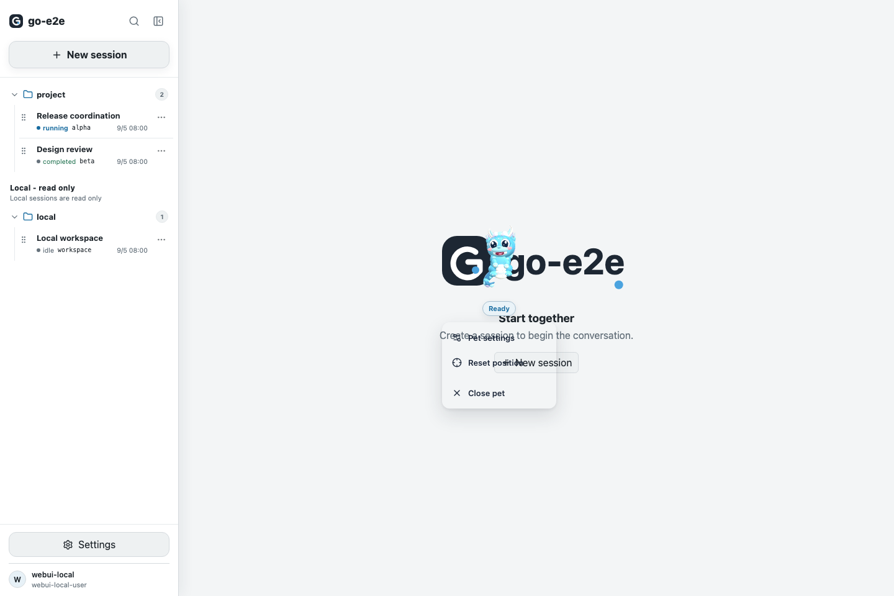
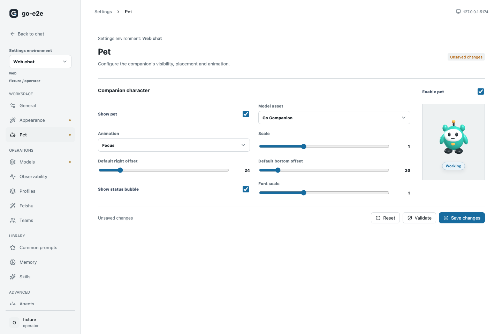

# Desktop Pet Acceptance Screenshots

These screenshots were captured by `web/e2e/settings-v2.spec.ts` during the desktop pet acceptance run on September 18, 2026.

## Pet Menu

The menu is positioned as a fixed overlay near the pet, with consistent typography, spacing, and viewport clamping.

## Pet Settings Preview

The settings preview shows the selected companion and its status badge inside the Pet settings panel.

The original Playwright output remains under `web/test-results` for detailed test-run inspection. These copies are kept as stable documentation assets for a future README demo.
