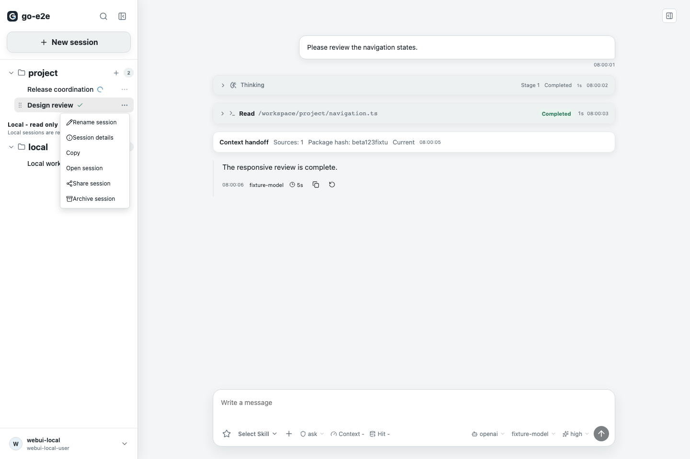
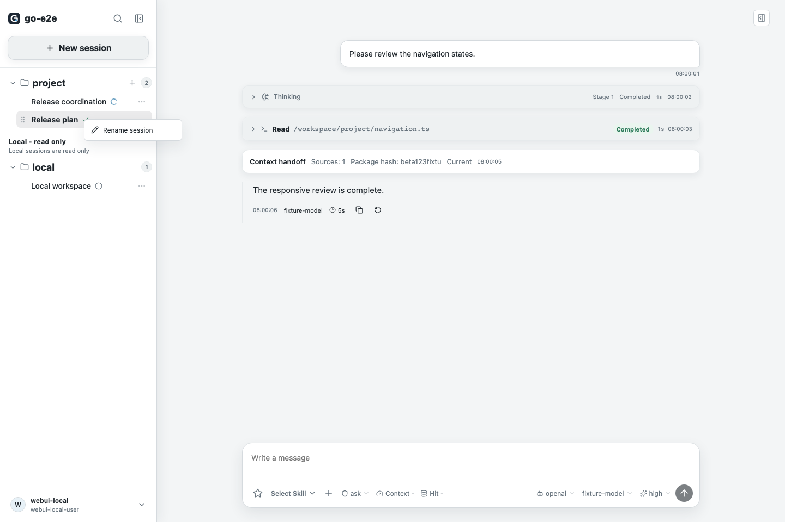
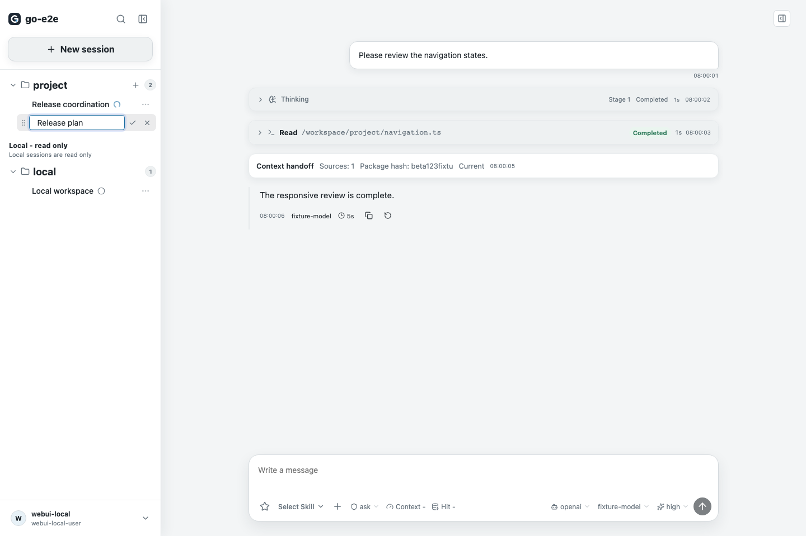
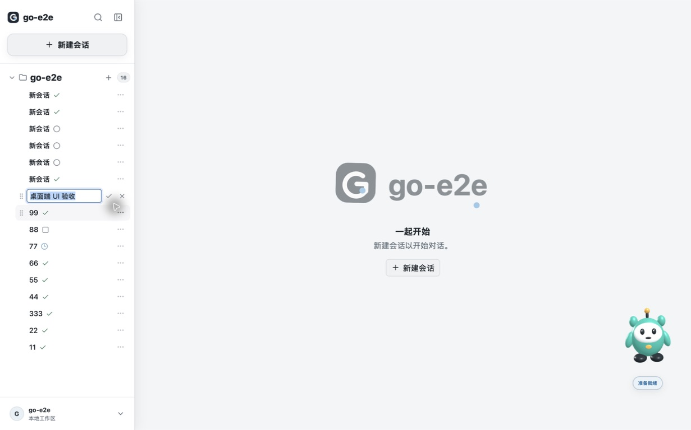

# 会话标题修改与验收

## 使用

会话卡片右侧的三个点菜单和卡片右键菜单都提供「修改标题」，共用同一个行内编辑框。

- Enter 或勾号保存，Escape、取消按钮或移出焦点取消。
- 自动去除首尾空格；空标题不提交，相同标题不重复写入。
- 中文输入法选词时的 Enter 不会误提交。
- 保存失败保留输入供重试，已保存的标题不变。
- 保持原有 31px 会话行高度、14px 标题字号和纯色样式。
- 本地导入的只读会话继续遵循原有只读策略。

## 实现边界

两个入口复用 `SessionTitleEditor` 和 `useRenameSession`。调用既有
`PATCH /tenant/sessions/{id}`，只发送 `title`，不新增后端接口或数据库迁移。
成功后更新当前身份与服务地址下的列表、详情缓存，并重新读取后端；
不替换会话消息或运行状态。

Mac 实机验收发现按钮点击可能先触发输入框失焦取消，因此保存与取消按钮阻止
鼠标按下时的默认焦点转移，同时保留键盘焦点操作。已加入回归测试。

## 验收

2026-09-19：

- 类型检查与桌面生产构建通过，macOS arm64 应用签名校验通过。
- 改名相关组件、客户端、缓存测试共 65 项通过。
- Playwright 的桌面、窄屏和移动端共 6 项通过，覆盖两个入口、刷新持久化、
  失败重试、取消、深浅主题和窄侧栏尺寸。
- Mac 实际窗口验证了两个入口、中文标题、Enter 与勾号保存、退出重启后的持久化。
  临时验收标题已恢复，不改变会话内容。

复验命令：

```bash
npm --prefix web run typecheck
npm --prefix web test
cd web
GO_E2E_WEBUI_E2E_PORT=5198 npm run test:e2e -- session-rename.webui-v2.spec.ts
```

桌面构建命令为仓库根目录的 `./scripts/build-desktop-v2.sh`，
产物为 `desktop-v2/build/bin/go-e2e.app`。

## 演示截图

前三张使用自动化测试示例数据，最后一张为 Mac 桌面端真实窗口。
截图保留在文档目录，供 README 和后续演示复用。

### 三个点菜单



### 右键菜单



### 行内编辑



### Mac 实际窗口


